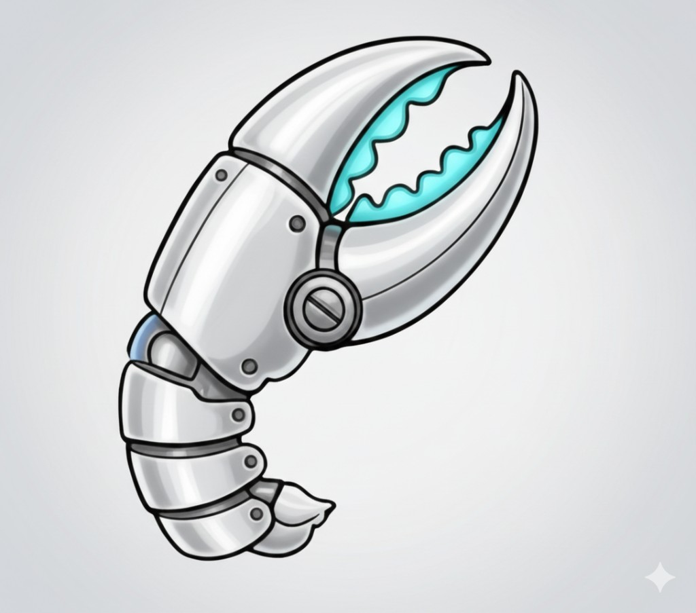

# Clawforce

<p align="center">
  
</p>

**Enterprise AI agent management for teams that can't afford to get security wrong.**

Clawforce deploys, routes, and monitors autonomous AI agents on your infrastructure — with built-in PII protection, compliance logging, and intelligent cost optimization. Your data never leaves your network. Sensitive requests route to local models automatically.

Built on [OpenClaw](https://github.com/openclaw/openclaw), the open-source multi-channel AI gateway.

---

## 30-Second Overview

Clawforce is a control plane for OpenClaw that answers three practical questions:

1. **Which model should handle this message?**  
   Route by sensitivity, policy, complexity, domain, and budget.
2. **Can we prove what the agent did?**  
   Capture structured audit events (JSONL + SQLite) and compliance-friendly records.
3. **Can we run this safely in production?**  
   Deploy with secure defaults, model health checks, and runtime visibility.

Use Clawforce when you want OpenClaw agents in production with stronger controls for security, spend, and operations.

## What It Adds On Top of OpenClaw

- **Intelligent model routing** — A 5-dimension router (PII sensitivity, data policy, complexity, domain, budget) selects the right model per request.
- **Cost controls** — Daily budget caps plus automatic fallback to local models when limits are exceeded.
- **Compliance-ready logging** — Structured logs and a queryable SQLite store, with profiles for HIPAA, PCI-DSS, GDPR, CCPA, and SOX.
- **Operational dashboard** — Agent health, activity, alerts, and cost trends in one place.
- **One-command deployment** — One YAML config and `clawforce deploy` to generate and run the stack with Docker Compose.

```
Customer Infrastructure (channels, tools, data)
    │
[Clawforce]  ← orchestration, security, compliance, cost intelligence
    │
[OpenClaw]   ← open-source AI gateway (20+ channels, 15+ LLM providers)
    │
[LLM Providers]  ← Anthropic, OpenAI, Google, or local models (Ollama, vLLM, SGLang)
```

## Why It Matters

| Value | Proof Point |
|-------|------------|
| **Cost savings** | Mixed workloads can reduce cloud spend by routing simple tasks to local models first |
| **Data sovereignty** | PII is enforced as a safety invariant and blocked from cloud routing |
| **Compliance** | Full audit trail with model, reason, and PII classification per decision |
| **Operational visibility** | Dashboard with health, activity, alerts, cost tracking, and what-if analysis |
| **Time to value** | One YAML file, one command: `clawforce deploy` |

---

## Quick Start

```bash
npm install -g clawforce

# Create a config file
cat > clawforce.yaml << 'EOF'
name: my-agent
role: inbox-analyst
models:
  primary: "anthropic/claude-sonnet-4-5"
  credential_mode: env
  provider_keys:
    anthropic: "${ANTHROPIC_API_KEY}"
gateway:
  bind: loopback
dashboard:
  enabled: true
  port: 3000
  auth:
    enabled: false
router:
  enabled: true
compliance:
  enabled: true
openclaw:
  channels:
    discord:
      enabled: true
      token: "${DISCORD_BOT_TOKEN}"
runtime:
  engine: "ollama"
  location: "container"
  model: "qwen3.3:8b"
  gpu: "nvidia"
EOF

# Deploy
clawforce deploy -c clawforce.yaml
```

This starts an OpenClaw gateway, a local model via SGLang/Ollama, the compliance logger, and the monitoring dashboard — all via Docker Compose.

Secure-by-default deployment behavior:
- Gateway binds to `loopback` unless explicitly set to `gateway.bind: lan`.
- Dashboard requires an explicit auth policy whenever dashboard is enabled.
- Deploy runs an OpenClaw security audit gate and blocks on critical findings.

---

## Features

### 5-Dimension Model Router

Routes every request across 5 dimensions to pick the right model:

- **Sensitivity** — PII detection (SSN, credit cards, emails, phone numbers, passports, IBANs, IP addresses) with adversarial defense (unicode normalization, homoglyph folding, zero-width character stripping)
- **Policy** — Channel and user-based data classification (restricted, confidential, internal, public)
- **Complexity** — Heuristic scoring routes simple prompts to cheap local models, complex prompts to capable cloud models
- **Domain** — Classifies prompts (code, writing, analysis, data, conversation) for specialized model routing
- **Budget** — Daily spend limits with automatic fallback to local models when over budget

PII never routes to cloud models. This is enforced as a post-routing safety invariant regardless of configuration.

```yaml
router:
  enabled: true
  rules:
    - condition: "pii_detected"
      model: "sglang/qwen3-32b"
    - condition: "medium_complexity"
      model: "openai/gpt-4o-mini"
    - condition: "high_complexity"
      model: "anthropic/claude-sonnet-4-5"
    - condition: "domain_code"
      model: "openai/gpt-4o"
    - condition: "over_budget"
      model: "sglang/qwen3-32b"
  sensitivity_keywords: ["password", "secret", "confidential"] # merged with sensitivity.blocklist
  priority: ["sensitivity", "cost", "domain", "complexity"]
  budget:
    daily_limit: 10.00
    fallback_model: "sglang/qwen3-32b"
```

### Model Health and Failover

Local model runtimes are actively health-checked (Ollama, SGLang, vLLM) with circuit-breaker behavior. When a selected local provider is unhealthy:

- `block` denies the request.
- `failover-safe` allows only non-sensitive requests to fall back to cloud.

```yaml
router:
  health_check:
    enabled: true
    failover_policy: block      # block | failover-safe
    retry_attempts: 2           # probe retries before marking failure
    retry_delay_ms: 500         # delay between probe retries
```

PII confidence filtering is configurable globally and per pattern:

```yaml
sensitivity:
  pii_detection: true      # default true; set false only for controlled experiments
  blocklist: ["secret"]    # additional keywords merged into router.sensitivity_keywords
  pii_confidence_threshold: 0.80
  pii_pattern_thresholds:
    ip_address: 0.50
```

### Output Filtering

Outbound messages and tool results are scanned for PII before leaving the agent. Matches are replaced with redaction markers like `[SSN_REDACTED]`, `[EMAIL_REDACTED]`, etc.

### Deployment Security Gate

`clawforce deploy` runs `openclaw security audit --deep` inside the gateway container and fails deployment on critical findings. For local-only iteration, you can bypass this with `CLAWFORCE_SKIP_SECURITY_AUDIT=1`.

### Compliance Logging

Every agent action is captured as structured JSONL and SQLite:
- Tool executions (name, success, duration)
- Messages received and sent (channel, content length, model used)
- Routing decisions (model, reason, PII types, dimension)
- Session lifecycle events
- Budget state tracking (daily spend, request counts)

Data is dual-written: JSONL files remain the source of truth for durability and SIEM export, while SQLite provides fast indexed queries for the dashboard and audit CLI.

### Compliance Framework Profiles

Pre-built profiles for common regulatory frameworks:
- **HIPAA** — Healthcare data protection
- **PCI-DSS** — Payment card security
- **GDPR** — EU data protection
- **CCPA** — California consumer privacy
- **SOX** — Financial reporting controls

### Activity Dashboard

Next.js dashboard with 5 panels:
- **Agent Status** — Container health, uptime, and local model health state
- **Activity Feed** — Real-time event streaming from compliance log
- **Alerts** — Real-time operational alerts with acknowledge workflow (budget, PII, health, errors, idle agents)
- **Cost Tracker** — Gateway-sourced cost data with Summary, Timeline, and What-If analysis tabs
- **Task Log** — Recent agent runs with duration and outcome

**Authentication** — Auth.js v5 with username/password credentials stored in SQLite. Dashboard-enabled configs must explicitly declare an auth policy (`dashboard.auth.enabled: true|false`).

### Multi-Agent Deployments

Deploy multiple specialized agents from a single config, each with its own role, channels, and budget:

```yaml
name: my-workforce
defaults:
  models:
    cloud: "anthropic/claude-sonnet-4-5"
    local: "ollama/llama3.3:8b"
agents:
  - name: inbox-analyst
    role: inbox-analyst
    channels: [{ type: channel, channels: ["1234567890123456789"] }]  # Discord channel ID
    routing: { budget_daily: 5.00 }
  - name: research-agent
    role: research-agent
    channels: [{ type: channel, channels: ["1234567890123456791"] }]  # Discord channel ID
    routing: { budget_daily: 10.00 }
```

Per-agent budget isolation, channel routing, and supervisor hierarchies. See [docs/MULTI-AGENT.md](docs/MULTI-AGENT.md) for the full reference.

### Agent Role Templates

Three starter templates included:
- **Inbox Analyst** — Monitors channel activity, summarizes threads, flags action items
- **Research Agent** — Takes requests via configured channels, browses web, compiles reports
- **Process Automator** — Cron-triggered browser workflows, reports results

---

## CLI

```bash
clawforce deploy -c clawforce.yaml     # Deploy from config
clawforce status                        # Check container health
clawforce stop                          # Stop deployment
clawforce audit                         # View container logs
clawforce audit --source compliance     # View structured compliance log
clawforce audit --source database       # Query SQLite database directly
clawforce audit --source database --event tool_call --since 2026-02-15T00:00:00Z
clawforce audit --source database --pii-only  # PII routing decisions only
clawforce audit -n 100                  # Last 100 entries
clawforce migrate --data-dir ./data     # Backfill JSONL logs into SQLite
clawforce migrate --dry-run             # Preview migration without writing
clawforce route-test "your prompt"      # Test routing decision without deploying
clawforce user add admin -p "password" -r admin   # Add dashboard user
clawforce user list                     # List dashboard users
clawforce user remove admin             # Remove dashboard user
```

### Route Test

Preview routing decisions before deploying:

```
$ clawforce route-test "fix this TypeScript bug" -c clawforce.yaml

Model: openai/gpt-4o
Reason: Domain "code" — routing to specialized model
Dimensions:
  PII: no
  Complexity: low
  Domain: code (confidence: 0.14)
  Budget: $0.00/$10.00 remaining
```

---

## Configuration

Full `clawforce.yaml` reference:

```yaml
name: my-agent
role: inbox-analyst              # inbox-analyst | research-agent | process-automator

deployment:
  agent_runtime: openclaw        # Agent orchestration runtime target (defaults to openclaw)

models:
  primary: "anthropic/claude-sonnet-4-5"
  local: "sglang/qwen3-32b"
  credential_mode: env           # env | auth_profile
  provider_keys:
    anthropic: "${ANTHROPIC_API_KEY}"   # used when credential_mode=env

gateway:
  bind: loopback                 # loopback | lan

router:
  enabled: true
  rules: []                      # Custom routing rules (pii_detected | low_complexity | medium_complexity | high_complexity | domain_* | over_budget)
  sensitivity_keywords: []       # Router-level sensitivity keywords (merged with sensitivity.blocklist)
  priority:                      # Dimension evaluation order
    - policy
    - sensitivity
    - cost
    - domain
    - complexity
  budget:
    daily_limit: 10.00
    fallback_model: "sglang/qwen3-32b"
  health_check:
    enabled: true
    failover_policy: block       # block | failover-safe (queue not implemented)
    retry_attempts: 2            # 0..5, default 2
    retry_delay_ms: 500          # 0..5000, default 500

sensitivity:
  pii_detection: true            # Enabled by default
  blocklist: []                  # Additional keywords merged into router.sensitivity_keywords
  pii_confidence_threshold: 0.80 # 0.0..1.0 global minimum confidence
  pii_pattern_thresholds:        # Optional per-pattern overrides
    ip_address: 0.50

compliance:
  enabled: true

dashboard:
  enabled: true
  port: 3000
  auth:                          # Required whenever dashboard.enabled=true
    enabled: true
    username: admin
    password: "your-secure-password"  # Min 8 characters

runtime:
  engine: "ollama"               # Runtime engine id (e.g. ollama | sglang | vllm)
  location: "container"          # container | host
  model: "qwen3.3:8b"
  gpu: nvidia                    # nvidia | amd | none
  port: 11434                    # engine port (ollama default: 11434)

capabilities: full               # minimal | standard | full

alerts:
  enabled: true
  types:
    model_health: true
    budget_exceeded: true
    pii_violation: true
    agent_error: true
    agent_idle: true
  idle:
    threshold_minutes: 60
    cooldown_minutes: 30
  budget:
    cooldown_minutes: 60
    auto_block_on_exceeded: false
  notifications:
    dashboard: true
    email:
      enabled: false
      from: ""
      to: []
      smtp_host: ""
      smtp_port: 587
      username: ""
      password: ""

# --- Multi-Agent Mode (alternative to role/models above) ---
# defaults:
#   models:
#     cloud: "anthropic/claude-sonnet-4-5"
#     local: "ollama/llama3.3:8b"
#     credential_mode: env
#     provider_keys:
#       anthropic: "${ANTHROPIC_API_KEY}"
# agents:
#   - name: inbox-analyst
#     role: inbox-analyst
#     channels:
#       - type: channel
#         channels: ["1234567890123456789"]  # Discord channel ID
#     routing:
#       budget_daily: 5.00
# See docs/MULTI-AGENT.md for full multi-agent reference.

# Direct OpenClaw config passthrough
openclaw:
  channels:
    discord:
      enabled: true
      token: "${DISCORD_BOT_TOKEN}"
  agents:
    defaults:
      tools:
        sandbox: { enabled: true }
        browser: { enabled: true, headless: true }
```

NOTE: `deployment.agent_runtime` selects the agent orchestration target (currently `openclaw`). `runtime.engine` is separate and selects the model-serving engine (`ollama`, `sglang`, `vllm`) for local inference.

---

## Architecture

```
clawforce deploy
      |
      v
+------------------+     +------------------+     +------------------+
|   Router Plugin  |     | Compliance Plugin|     |    Dashboard     |
|   (5-dim routing)|     | (JSONL + SQLite) |     |   (Next.js)      |
+--------+---------+     +--------+---------+     +--------+---------+
         |                        |                        |
         v                        v                        v
+------------------------------------------------------------------+
|                     OpenClaw Gateway                              |
|          (agent runtime, tools, channels, sandbox)               |
+------------------------------------------------------------------+
         |                        |                        |
         v                        v                        v
+------------------+    +------------------+    +------------------+
|  Local Models    |    |  Cloud Models    |    |  SQLite Storage  |
|  SGLang / Ollama |    |  Anthropic, etc  |    |  (clawforce.db)  |
+------------------+    +------------------+    +------------------+
```

The router plugin hooks into `before_agent_start` to override model selection, `message_sending` and `tool_result_persist` to redact PII from outputs, and `agent_end` for session audit logging.

---

## Development

```bash
git clone https://github.com/natefikru/clawforce.git
cd clawforce
pnpm install
pnpm test
```

Dashboard:

```bash
cd clawforce-dashboard
pnpm install
pnpm test           # 140 tests
```

### Plugin Build Pipeline

Clawforce bundles OpenClaw plugins to JavaScript during workspace setup/deploy.

- Output directory: `clawforce-<name>/config/extensions/<plugin>/`
- Artifacts: `index.js`, `index.js.map`, and `openclaw.plugin.json`

For local plugin development, use watch mode:

```bash
clawforce plugins-bundle -c clawforce.yaml
clawforce plugins-watch -c clawforce.yaml
```

### Test Coverage

Main project enforces 80% coverage thresholds (lines, functions, statements) and 75% branch coverage.

## Requirements

- Node.js 22+ (required for built-in `node:sqlite`)
- Docker and Docker Compose
- GPU recommended for local models (NVIDIA or AMD)

## License

MIT
